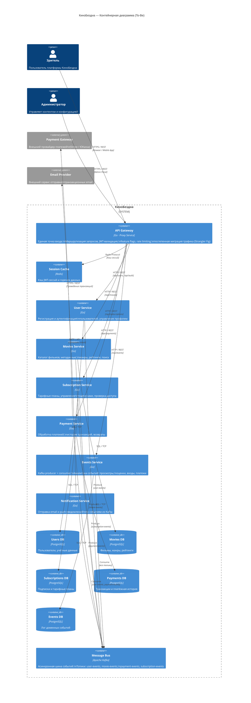

# КиноБездна — To-Be Архитектура

## Задание 1 — Контейнерная диаграмма (C4 Container)

### Описание доменов

| Домен | Сервис | Ответственность |
|---|---|---|
| **Шлюз** | API Gateway (Proxy) | Единая точка входа, маршрутизация, feature flags, rate limiting |
| **Пользователи** | User Service | Регистрация, аутентификация (JWT), управление профилем |
| **Фильмы** | Movies Service | Каталог фильмов, метаданные, жанры, рейтинги |
| **Подписки** | Subscription Service | Тарифные планы, управление подписками, доступ к контенту |
| **Платежи** | Payment Service | Обработка платежей, история транзакций |
| **События** | Events Service | Kafka producer/consumer, аналитика действий пользователей |
| **Уведомления** | Notification Service | Email/push-уведомления по событиям из Kafka |

### Интеграционное взаимодействие

- **Синхронное (HTTP/REST)** — API Gateway → сервисы (запрос-ответ)
- **Асинхронное (Kafka)** — сервисы публикуют доменные события; Events Service и Notification Service подписываются на топики
- **Кэш (Redis)** — API Gateway кэширует сессии и горячие данные

---

### C4 Container Diagram — КиноБездна (To-Be)

---

### Ключевые архитектурные решения

1. **Database per Service** — каждый сервис имеет собственную схему БД, исключая прямые межсервисные JOIN-запросы.
2. **Strangler Fig** — API Gateway постепенно переключает трафик от монолита к микросервисам через feature flag `MOVIES_MIGRATION_PERCENT`.
3. **Event-Driven Integration** — доменные события публикуются в Kafka; потребители реагируют асинхронно, снижая связность сервисов.
4. **Single Entry Point** — весь внешний трафик проходит через API Gateway, который отвечает за аутентификацию, rate limiting и маршрутизацию.
